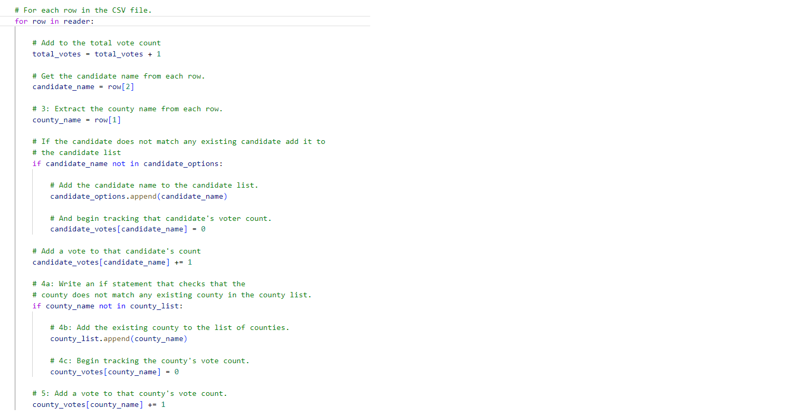
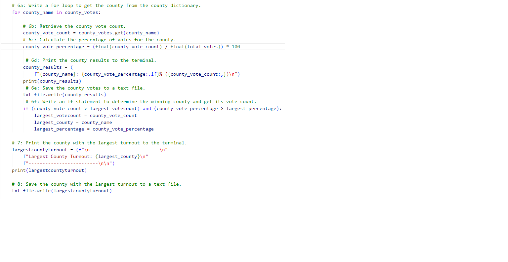
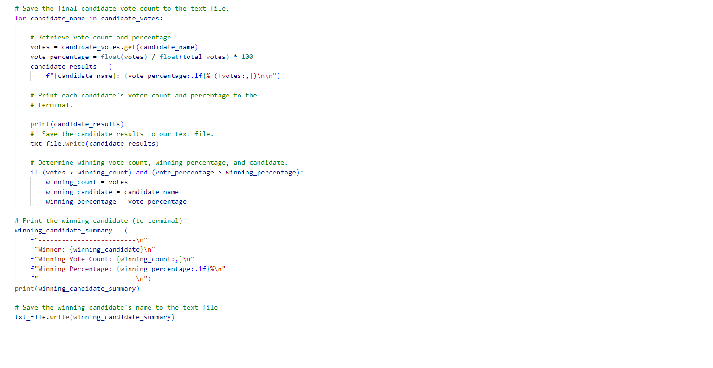

# Election-Analysis
## Project Overview
### Overview of Election Audit:

A Colorado Board of Elections employee has given the task to complete the election audit of a recent local congressional election.
1.	Calculate the total number of votes cast.
2.	Get a complete list of candidates who received votes.
3.	Calculate the total number of votes each candidate received.
4.	Calculate the percentage of votes each candidate won.
5.	Determine the winner of the election based on popular vote.
6.	Calculate total vote count in each county.
7.	Calculate percentage of total votes in each county.
8.	Determine county which received largest number of votes.

### Election-Audit results
#### How many votes were cast in this congressional election?
Code will read the election analysis file and count total no of votes.
      
      Initialize a total vote counter.
        total_votes = 0
        For each row in the CSV file.
    for row in reader:
        # Add to the total vote count
        total_votes = total_votes + 1

#### Provide a breakdown of the number of votes and the percentage of total votes for each county in the precinct.
For getting county from county dictionary, a for loop was added. In the same loop percentage was calculated using declaring a variable county_vote_percentage where the vote count for each county was divided by total votes obtained in all counties
        
        county_vote_percentage = (float(county_vote_count) / float(total_votes)) * 100

        Extract the county name from each row.
        county_name = row[1]
        if county_name not in county_list:
        Add the existing county to the list of counties.
        county_list.append(county_name)
        Begin tracking the county's vote count.
        county_votes[county_name] = 0
        Add a vote to that county's vote count.
        county_votes[county_name] += 1

#### Which county had the largest number of votes?
If statement was used to get county with largest number of votes.
       
       if (county_vote_count > largest_votecount) and (county_vote_percentage > largest_percentage):
        largest_votecount = county_vote_count
        largest_county = county_name
        largest_percentage = county_vote_percentage
#### Provide a breakdown of the number of votes and the percentage of the total votes each candidate received.
Vote count and percentage was calculated using a for loop 
        
        for candidate_name in candidate_votes:
        votes = candidate_votes.get(candidate_name)
        vote_percentage = float(votes) / float(total_votes) * 100
        candidate_results = (
        f"{candidate_name}: {vote_percentage:.1f}% ({votes:,})\n\n")
             

#### Which candidate won the election, what was their vote count, and what was their percentage of the total votes?
For determining the winning count, percentage and candidate, if statement was used.
       
       if (votes > winning_count) and (vote_percentage > winning_percentage):
        winning_count = votes
        winning_candidate = candidate_name
        winning_percentage = vote_percentage

## Resources
•	Data Source: election_results.csv
•	Software: Python 3.7.6, Visual Studio Code: 1.71.2

## Election-Audit Summary:
The analysis of the election results shows that:
#### There were 369,711 votes cast in the election.
#### The Counties were:
1) Jefferson
2) Denver
3) Arapahoe
#### The votes in each county were:
1) Jefferson received 10.5% of votes and 38,855 number of votes
2) Denver received 82.8% of votes and 306,055 number of votes
3)	Arapahoe received 6.7% of votes and 24,801 number of votes
#### Largest County Turnout: Denver
#### The candidates were:
1)	Candidate-1: Charles Casper Stockham
2)	Candidate-2: Diana DeGette
3)	Candidate-3: Raymon Anthony Doane
#### The Candidate results were:
1) Charles Casper Stockham received 23.0% of the vote and 85,213 number of votes.
2)	Diana DeGette received 73.8% of the vote and 272,892 number of votes.
3) Raymon Anthony Doane received 3.1% of the vote and 11,606 number of votes.
#### The Winner of the election was:
o	Diana DeGette who received 73.8% of the vote and 272,892 number of votes.

#### Python code which is written can be used to audit not only other congressional districts, but also senatorial districts and local elections by slightly modifying script.

